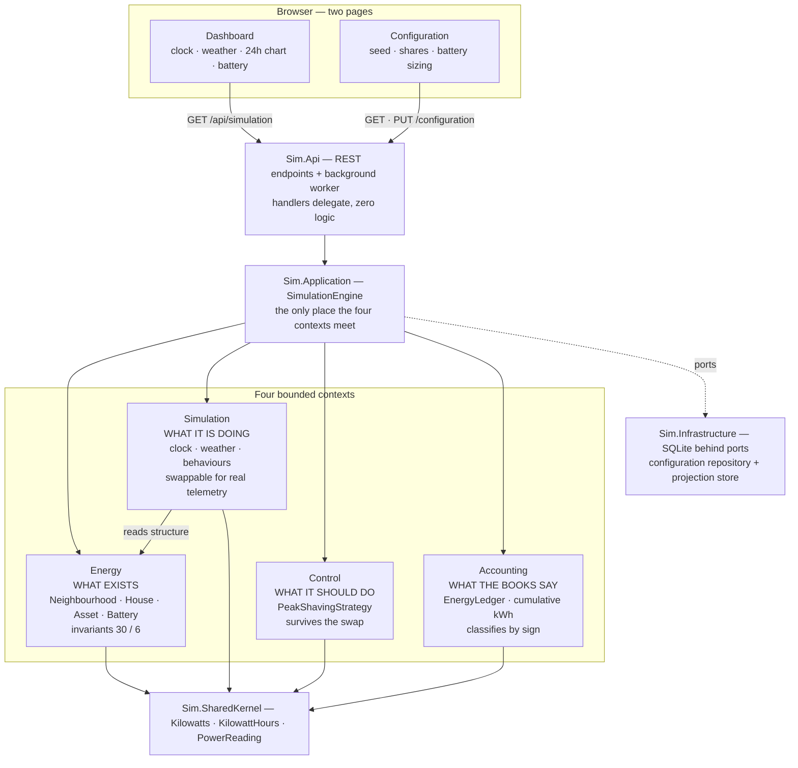
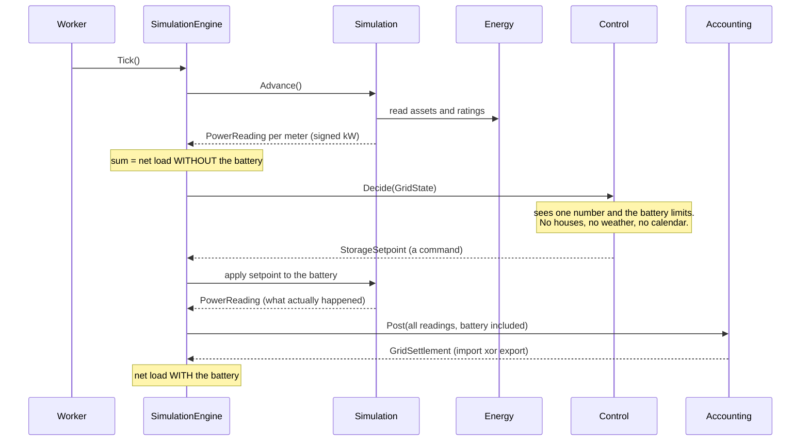

# Neighbourhood Energy Simulation

A deterministic, tick-based simulation of a neighbourhood - 30 houses and 6
public EV chargers - with energy accounting and a live view of what is
happening over time.

Built for the Utilus home assignment.

## Run it

```
docker compose up --build
```

Then open **http://localhost:8181**.

Without Docker — same port, so the instructions do not change:

```
dotnet run --project src/Sim.Api
```

No database to install, no npm, no build step, no network access required.

Port 8181 is used rather than the more common 8080 simply to avoid colliding
with whatever else is already running on the reviewer's machine. To change it,
edit the port mapping in `compose.yaml` (Docker) or `applicationUrl` in
`src/Sim.Api/Properties/launchSettings.json` (local).

## Pages

| Page | What it is for |
|---|---|
| http://localhost:8181/ | Dashboard: simulated clock, weather, live neighbourhood power, 24 simulated hours of net load with and without the battery, battery state of charge, per-meter cumulative energy |
| http://localhost:8181/config.html | Configuration: seed, asset distribution, tick size, speed and battery sizing |

## What it does

- Simulates 30 houses and 6 public chargers at a configurable tick, 15 simulated
  minutes by default.
- Houses carry base consumption always, plus optional PV, heat pump and home EV
  charger, distributed 40 / 30 / 20 per cent from a seed.
- Synthetic deterministic weather drives PV generation and heat pump demand,
  with a season derived from the simulated month.
- Tracks cumulative kWh for every one of the 62 meters since the simulation
  started, plus neighbourhood aggregate power and grid import and export.
- The same seed always produces the same run.

## API

| Method | Route | Purpose |
|---|---|---|
| GET | `/api/simulation` | Full dashboard snapshot |
| GET | `/api/simulation/configuration` | Current configuration |
| PUT | `/api/simulation/configuration` | Reconfigure and restart from a new seed |
| POST | `/api/simulation/pause` | Pause the clock |
| POST | `/api/simulation/resume` | Resume the clock |
| POST | `/api/simulation/configuration/reset` | Forget the stored configuration and restart from the file scenario |
| GET | `/healthz` | Liveness |

## Configuration — JSON file

The assignment allows three ways to define the neighbourhood: a seeded random
generator with stated proportions, **a configuration file (JSON/YAML)**, or
code. This project uses the first two together, and the file covers everything.

`src/Sim.Api/appsettings.Simulation.json` has two halves:

| Section | What it decides |
|---|---|
| `Simulation:Scenario` | **Which world to build**: seed, start instant, tick size, speed, the 40/30/20 asset distribution, and every battery field |
| everything else | **How the physics behave**: PV capacity range, heat pump balance point, charger power and session sizes, arrival rates, the daily load shape, and the weather constants |

JSON rather than YAML because .NET binds it natively; YAML would add a
dependency for an identical result.

### What the file deliberately does NOT contain

The house count and the public charger count. The assignment states *exactly*
30 houses and *exactly* 6 public chargers, so they are constraints rather than
settings, and they are enforced by `NeighbourhoodInvariants` in the domain. A
configuration file that could set the house count to 25 would be a file that
could violate a requirement. No value in the file and no API payload can move
them — there is a test for it.

### Precedence

Three sources can supply the scenario, consulted in this order:

1. **A configuration saved through the web page** (stored in SQLite). It wins,
   because its existence means someone made a decision and a restart should not
   silently overrule them.
2. **`Simulation:Scenario` in the JSON file.** Authoritative on a first boot.
3. **Hardcoded fallback values**, used only when the file is absent, so the
   application still starts without it.

The consequence worth knowing: editing the file after the first run appears to
do nothing, because the stored row is winning. That is intended. To go back to
the file:

```
curl -X POST http://localhost:8181/api/simulation/configuration/reset
```

An invalid scenario fails the boot with a message naming the field, rather than
quietly running something plausible-looking.

## Architecture

Four bounded contexts, each its own project, each answering one question. Only
one reference exists between any of them: Simulation reads the Energy structure
to learn which meters exist. Energy, Control and Accounting reference nothing
but the shared kernel.



### One tick, end to end

The ordering is the design. Non-storage assets are measured first, which yields
the net load the neighbourhood *would* have had with no battery. Control then
acts on that number. Both figures therefore exist without a second simulation
run — which is exactly what the peak-shaving chart needs.



A `StorageSetpoint` is what we asked for; a `PowerReading` is what happened.
They differ whenever the battery cannot comply, and that difference is where
clamping becomes visible.

### Why the boundary is drawn there

The test that settles every placement question: **replace the simulation with
real IoT telemetry and see what has to change.**

- Simulation disappears — readings arrive from hardware instead.
- The battery's simulated physical response disappears — state of charge becomes telemetry.
- **The peak-shaving policy survives unchanged.** You still want to shave peaks
  on real hardware.
- Energy and Accounting are untouched.

Anything that survives that swap cannot belong to Simulation. That is why
Control is its own context (ADR-0009), and why Energy describes rather than
behaves (ADR-0001).

## Documentation

| Document | What is in it |
|---|---|
| [docs/design.md](docs/design.md) | Design overview, components, data model, physical assumptions |
| [docs/c4.md](docs/c4.md) | C4 levels 1 to 3, the tick sequence, the dependency rule |
| [docs/assumptions.md](docs/assumptions.md) | Every assumption, the open points, limitations and next steps |
| [docs/adr/](docs/adr/) | Eight architecture decision records, each with the alternatives rejected |
| [docs/requirements.md](docs/requirements.md) | Every assignment requirement with an honest status |
| [docs/tasks/](docs/tasks/) | The task breakdown the work was executed from |
| [AI - Prompts/](AI%20-%20Prompts/) | The AI prompt log required by the assignment |

## Structure

```
src/Sim.SharedKernel     units and deterministic noise      no dependencies
src/Sim.Simulation       SimulationRun: clock, weather      bounded context
src/Sim.Energy           Neighbourhood: houses, physics     bounded context
src/Sim.Accounting       EnergyLedger: kWh, settlement      bounded context
src/Sim.Application      translation, ports, engine
src/Sim.Infrastructure   SQLite adapters, tick bus
src/Sim.Api              composition root, REST, worker
```

Three bounded contexts, one aggregate root each, no references between them -
`Sim.Energy` cannot reference `Sim.Accounting` because the project reference
does not exist. Everything crossing between them is explicitly translated.
See [ADR-0001](docs/adr/0001-three-bounded-contexts-as-separate-projects.md).

## Current status

Working and verified at runtime: the simulation engine, energy accounting, the
controllable clock, weather and seasonality, the neighbourhood battery with
peak shaving, JSON configuration, SQLite persistence, both web pages, and
**141 tests**.

Verified end to end rather than assumed:

```
energy conservation      generation + import == consumption + export, exact
peak shaving             127.3 -> 64.8 kW within the 24h window (49% flatter)
configuration            file seed drives a first boot; a saved configuration
                         survives restart; reset returns to the file; the app
                         still starts with no file at all
invariants               a hostile API payload is clamped and the neighbourhood
                         is still exactly 30 houses and 6 public chargers
```

Known gaps and what we would do next are in
[docs/assumptions.md](docs/assumptions.md); every assignment requirement has an
honest status in [docs/requirements.md](docs/requirements.md).
