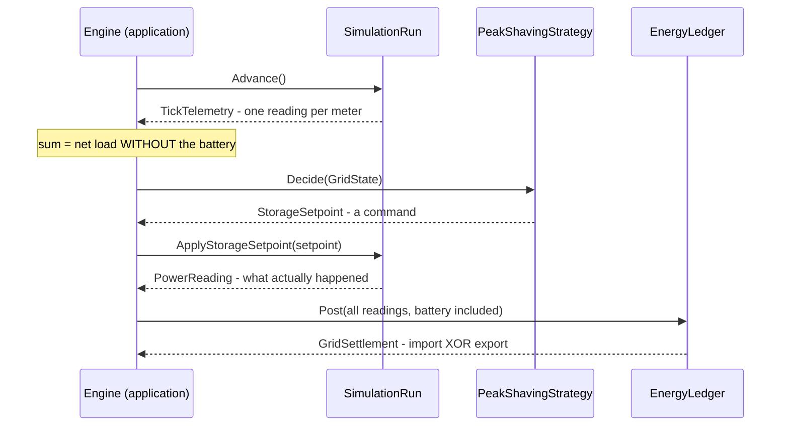

# How the bounded contexts work with their aggregate roots

One aggregate root per bounded context. Each root answers exactly one question,
exposes only the public surface that question needs, and never reaches into
another root. Everything below is the whole system - there is nothing else to
know before reading code.

| Context | Aggregate root | The question it answers |
|---|---|---|
| Energy | `Neighbourhood` | What exists? |
| Simulation | `SimulationRun` | What is everything doing right now? |
| Control | `PeakShavingStrategy` | What should the battery do about it? |
| Accounting | `EnergyLedger` | What do the books say? |

## `Neighbourhood` - Energy - *what exists*

| Public member | What it does |
|---|---|
| constructor | Born valid or not born at all: exactly 30 houses, exactly 6 public charge points, unique meters, non-negative ratings. No configuration and no API payload can talk it out of these. |
| `Houses` · `PublicChargePoints` · `AllAssets` · `Battery` | Describe the physical world. `AllAssets` enumerates in a FIXED order - floating point addition is not associative, so a stable order is what keeps every aggregate result reproducible. |
| `Distribution` | The neighbourhood states its own 40/30/20 asset distribution - the documented figure cannot drift from reality, because it IS reality. |
| `TypeOf(meterId)` | Answers what kind of asset sits behind a meter. |

The root has no behaviour. It describes; it does not act. What an asset is
doing right now is somebody else's question.

## `SimulationRun` - Simulation - *what everything is doing right now*

| Public member | What it does |
|---|---|
| `Advance()` → `TickTelemetry` | Step 1 of every tick: advance the clock, sample the weather, produce exactly ONE reading per meter. The sum of these readings is the load the neighbourhood would have had WITHOUT the battery. |
| `ApplyStorageSetpoint(setpoint)` → `PowerReading` | Step 2: the battery physically responds to the command, for the tick just advanced, at most once per tick. The reading says what actually HAPPENED - it differs from the setpoint whenever the battery cannot comply. |
| `Storage` → `StorageState?` | What the battery currently holds - the one thing Control reads to decide. Null when the run has no battery. |

The run owns everything whose state crosses ticks: the clock, each meter's
behaviour (a charging session in progress), the battery's physical charge.
Replace this class with an IoT gateway emitting the same `PowerReading`
contract and the other three roots do not notice (ADR-0009).

## `PeakShavingStrategy` - Control - *what the battery should do*

| Public member | What it does |
|---|---|
| `Decide(gridState, duration)` → `StorageSetpoint` | Observes the load, recalculates the percentile thresholds over the rolling observed day, and: above the ceiling **discharge**, below the floor **recharge**, in between **rest**. Every command is limited by the rating and by what the cells can actually absorb or deliver - it never commands the impossible. |
| `Name` · `DischargeThresholdKw` · `RechargeThresholdKw` | The policy introduces itself and shows the thresholds it has learned. |

The controller sees ONE number and the battery's limits. No houses, no weather,
no calendar. A setpoint is a request, not a measurement - the distinction is
carried in the types.

## `EnergyLedger` - Accounting - *what the books say*

| Public member | What it does |
|---|---|
| `Post(instant, duration, readings)` → `GridSettlement` | Posts each reading to its meter's account, splits by SIGN in fixed order, settles with the grid (import XOR export, never both), accumulates the running totals. |
| `TotalConsumed` · `TotalGenerated` · `TotalImported` · `TotalExported` · `Accounts` | Cumulative energy per meter and for the neighbourhood since simulation start. |

The sign of a reading is this context's entire vocabulary. It never learns what
a heat pump is - which is exactly why swapping the simulation for real
telemetry does not touch a line of it.

## The flow: one tick, four sentences

Every tick, the application engine makes four calls - one per root:

```
telemetry  = run.Advance()                       what happened, without the battery
setpoint   = strategy.Decide(gridState)          what the battery should do about it
reading    = run.ApplyStorageSetpoint(setpoint)  what the battery actually managed
settlement = ledger.Post(all readings)           what the books record
```



The ordering IS the design: measuring the non-storage meters first yields the
without-battery counterfactual for free, which is exactly what the peak-shaving
visualisation needs - no second simulation run exists anywhere.

## Where the rules live

- Structural invariants: in the roots' constructors - an invalid aggregate is
  unrepresentable (`NeighbourhoodInvariantViolation`, `SimulationInvariantViolation`).
- Physics: named members of the leaves (`BatterySimulator`, the behaviours) -
  every rule is a method whose name states it.
- Policy: only in Control.
- Proof: one scenario folder per domain class under `tests/`, class per
  scenario, one assert per consequence (ADR-0014) - the executable version of
  this document.

Related: [ADR-0001](adr/0001-three-bounded-contexts-as-separate-projects.md) ·
[ADR-0009](adr/0009-control-is-its-own-context.md) ·
[ADR-0013](adr/0013-process-aggregates-not-services.md) ·
[ADR-0014](adr/0014-scenario-tests-as-executable-requirements.md) ·
[c4.md](c4.md)
