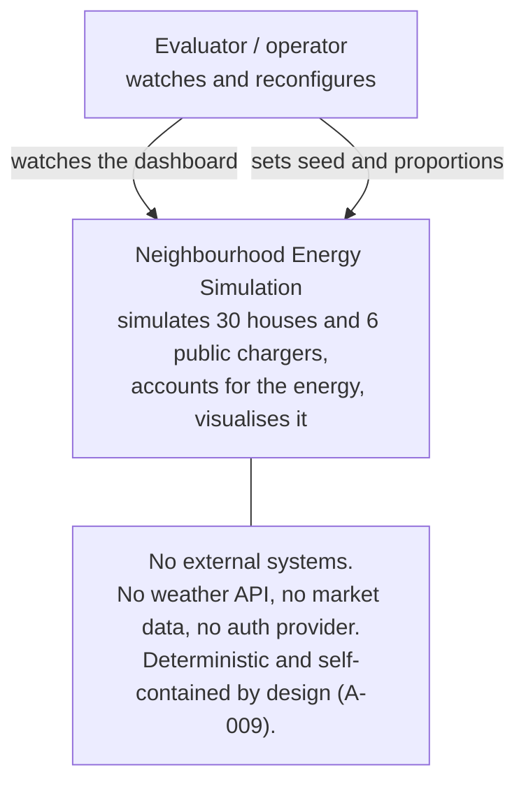
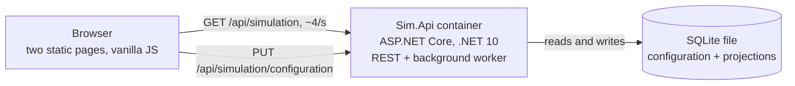
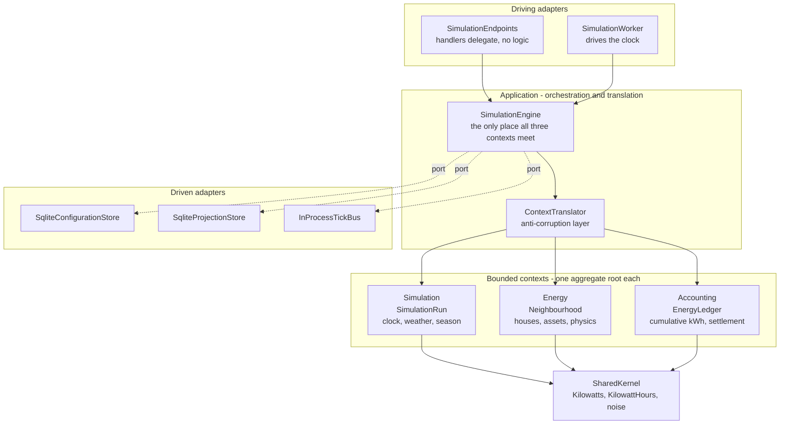
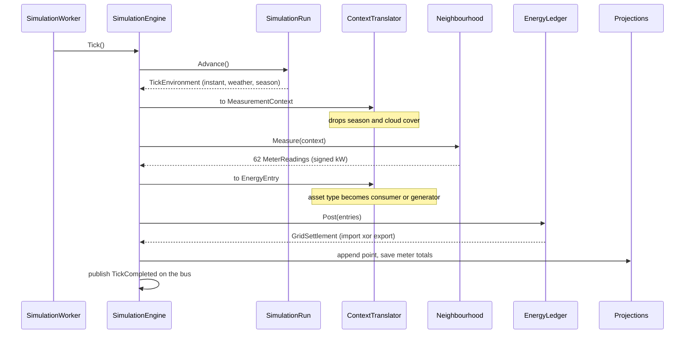
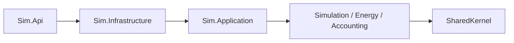

# C4 model

Levels 1 to 3. Level 4 (code) is the source itself and is not duplicated here.

## Level 1 - System context

The absence of external systems is a decision, not an omission. The assignment
asks for privacy-friendly and deterministic behaviour, and every external
dependency is a source of non-reproducibility.

## Level 2 - Containers

One deployable. The tick loop is a `BackgroundService` inside the API container
rather than a separate worker - see ADR-0004 for why that seam exists but is
not yet split.

## Level 3 - Components, and where the boundaries are

The three context boxes have **no arrows between them**. That is the whole
point: `Sim.Energy` has no project reference to `Sim.Accounting`, so the arrow
cannot be drawn even by accident (ADR-0001). Everything crossing between them
passes through the translator.

## One tick, end to end

Two translation points, both in the application layer, both deliberately lossy.
Note also that `Neighbourhood` returns readings and nothing else - it measures
but does not account. Settlement is `EnergyLedger`'s job.

## The dependency rule

Dependencies point inward only. `SharedKernel` references nothing. The contexts
reference only `SharedKernel`. No context references ASP.NET, SQLite or any
other infrastructure type.

Currently enforced by project references. An architecture test that locks it
against future edits is outstanding work (TASK-008).
