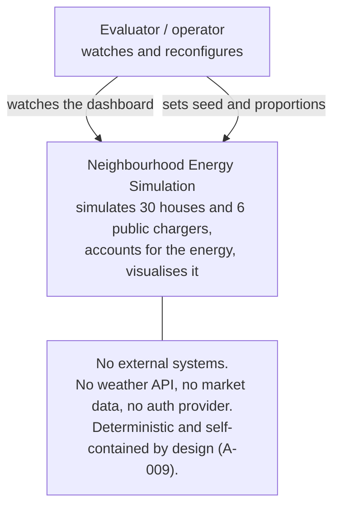
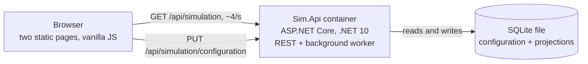
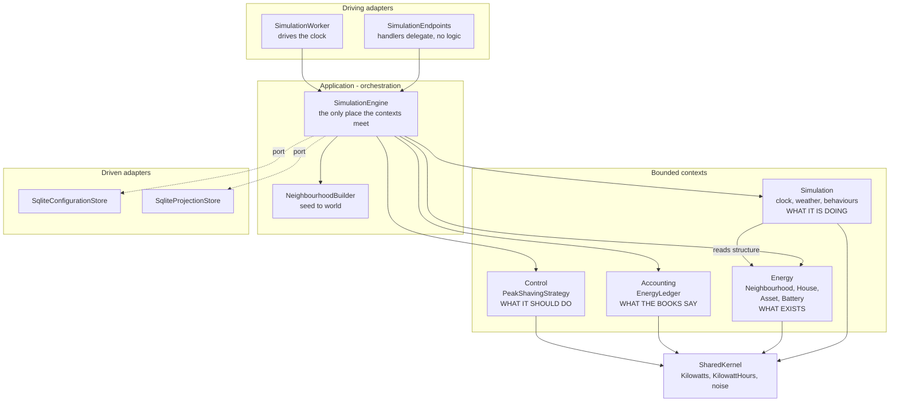
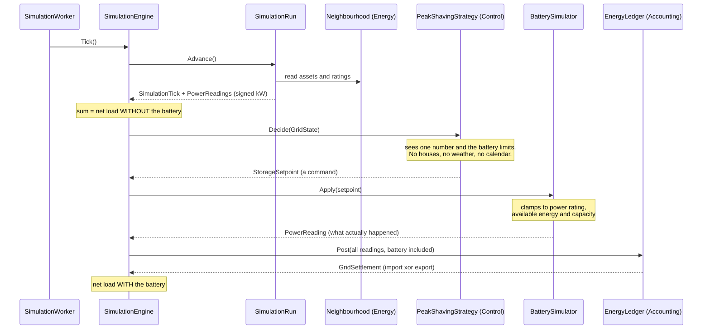
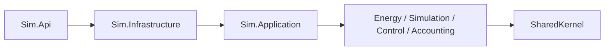

# C4 model

Levels 1 to 3. Level 4 (code) is the source itself and is not duplicated here.

## Level 1 - System context

The absence of external systems is a decision, not an omission. The assignment
asks for privacy-friendly and deterministic behaviour, and every external
dependency is a source of non-reproducibility.

## Level 2 - Containers

One deployable. The tick loop is a `BackgroundService` inside the API container
rather than a separate worker - see ADR-0004 for why that seam exists but is
not yet split.

## Level 3 - Components, and where the boundaries are

Energy, Accounting and Control have **no arrows between them**. `Sim.Energy` has
no project reference to `Sim.Accounting`, so the arrow cannot be drawn even by
accident (ADR-0001).

Simulation reads the Energy structure - it must, to know which meters exist -
but that arrow points one way only, and Energy knows nothing of Simulation. That
is what makes the producer replaceable: swap Simulation for an IoT gateway and
Energy, Control and Accounting are untouched (ADR-0009).

## One tick, end to end

The ordering is the design. Non-storage assets are measured first, which yields
the net load the neighbourhood would have had with no battery at all. Control
then acts on that number, and the post-battery figure follows. Both figures
therefore exist naturally, which is exactly what the peak-shaving visualisation
needs - no second simulation run required.

Note also the distinction between a `StorageSetpoint` and a `PowerReading`: one
is what we asked for, the other is what happened. They differ whenever the
battery cannot comply, and that difference is where clamping becomes visible.

## The dependency rule

Dependencies point inward only. `SharedKernel` references nothing. The contexts
reference only `SharedKernel`. No context references ASP.NET, SQLite or any
other infrastructure type.

Currently enforced by project references. An architecture test that locks it
against future edits is outstanding work (TASK-008).
